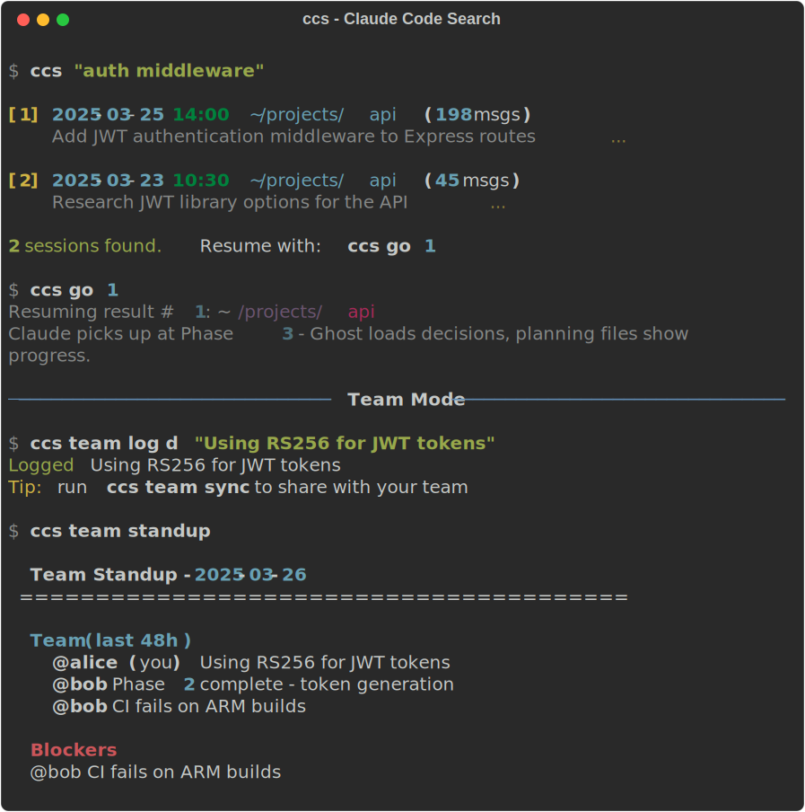
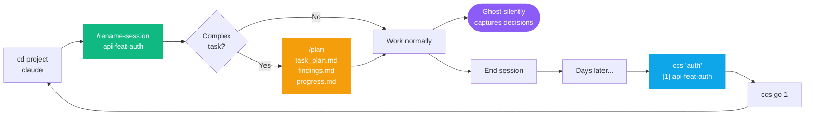

# Claude Code Power Stack

[](https://github.com/bluzername/claude-code-power-stack/actions/workflows/ci.yml)
[](https://github.com/bluzername/claude-code-power-stack/releases)
[](LICENSE)
[](CONTRIBUTING.md)
[]()
[](https://docs.anthropic.com/en/docs/claude-code)

**Stop losing context. Start every session where you left off.**

A curated toolkit that gives [Claude Code](https://docs.anthropic.com/en/docs/claude-code) persistent memory, cross-project search, structured planning, and session management - so you never repeat work across projects.

<p align="center">
  
</p>

```bash
curl -fsSL https://raw.githubusercontent.com/bluzername/claude-code-power-stack/main/setup.sh | bash
```

> **[Cheatsheet PDF](docs/cheatsheet.pdf)** (print it) | **[Workflow Guide](docs/workflow-guide.md)** (read it) | `ccs cheat` (in your terminal)

**Jump to:** [What's in the Stack](#whats-in-the-stack) | [Quick Start](#quick-start) | [How It Works](#how-it-works) | [Deep Dive](#deep-dive-each-tool) | [Team Mode](#team-mode) | [Quick Reference](#quick-reference) | [FAQ](#faq)

---

## What's in the Stack

| Tool | What it solves | How it works |
|------|---------------|-------------|
| **[Ghost](https://github.com/wcatz/ghost)** | "I already figured this out last week" | MCP server that auto-captures decisions, mistakes, and patterns per project |
| **[cc-conversation-search](https://github.com/akatz-ai/cc-conversation-search)** | "Where was I working on X?" | Cross-project semantic search via `ccs` CLI |
| **Session naming** | "Which session was the auth refactor?" | `/rename-session` command with structured naming convention |
| **Planning-with-files** | "I lost track halfway through" | File-based working memory for complex, multi-step tasks |
| **Team Mode** | "What did my teammate decide?" | Shared append-only log via git (`ccs team`) |

### The problem this solves

```
Without                              With Power Stack
---------                            ----------------
"What did I decide last week?"       Ghost auto-captured it
"Which session had the auth work?"   ccs "auth" finds it in seconds
"Where was I in this feature?"       task_plan.md says Phase 3, next: tests
"I need to re-research everything"   findings.md has all your notes
"What did my teammate decide?"       ccs team shows their log entries
```

Ghost and cc-conversation-search handle the **between-sessions** problem.
Planning-with-files handles the **within-session** problem (long tasks that exhaust context).

### Session lifecycle



---

## Quick Start

### Prerequisites

- [Claude Code](https://docs.anthropic.com/en/docs/claude-code) installed and working
- [Go 1.21+](https://go.dev/dl/) (for Ghost)
- [Ollama](https://ollama.com/) with the `nomic-embed-text` model (required by Ghost for embeddings)
- [uv](https://github.com/astral-sh/uv) (for cc-conversation-search) - or pip

<details>
<summary><b>Don't have Go, Ollama, or uv?</b> (click to expand)</summary>

```bash
# macOS (Homebrew)
brew install go
brew install uv

# Or skip Go entirely - install Ghost via Homebrew instead:
brew install wcatz/tap/ghost

# uv without Homebrew:
curl -LsSf https://astral.sh/uv/install.sh | sh

# Ollama (required - Ghost will crash without it)
# Download from https://ollama.com/ or:
brew install ollama
ollama serve &          # Start the Ollama server
ollama pull nomic-embed-text  # Download the embedding model Ghost needs
```
</details>

> **Important:** Ghost requires Ollama running with the `nomic-embed-text` model. Without it, Ghost's MCP server will start but immediately crash with "Connection closed". Make sure `ollama serve` is running before starting Claude Code.

### Install

**One-liner** (clones to `~/.claude-power-stack` and runs the installer):
```bash
curl -fsSL https://raw.githubusercontent.com/bluzername/claude-code-power-stack/main/setup.sh | bash
```

**Or clone manually:**
```bash
git clone https://github.com/bluzername/claude-code-power-stack.git
cd claude-code-power-stack
./install.sh
```

The install script will:
1. Install Ghost and register it as an MCP server
2. Install cc-conversation-search and build the initial index
3. Copy the `/rename-session` command to your Claude Code config
4. Copy the planning-with-files skill to your Claude Code config
5. Update your CLAUDE.md with usage instructions

### Manual install

If you prefer to install components individually:

```bash
# Ghost
go install github.com/wcatz/ghost/cmd/ghost@latest
ghost mcp init

# cc-conversation-search
uv tool install cc-conversation-search
cc-conversation-search init

# Commands and skills (copy to your Claude Code config)
cp commands/rename-session.md ~/.claude/commands/
cp -r skills/planning-with-files ~/.claude/skills/
cp rules/session-naming.md ~/.claude/rules/common/
```

### Verify

```bash
./verify.sh
```

### Troubleshooting

<details>
<summary><b>Ghost crashes with "Connection closed" (most common issue)</b></summary>

Ghost requires [Ollama](https://ollama.com/) running locally with the `nomic-embed-text` embedding model. Without it, Ghost's MCP server starts but immediately crashes.

**Fix:**
```bash
# Install Ollama if needed
brew install ollama   # or download from https://ollama.com/

# Start the server
ollama serve &

# Pull the embedding model
ollama pull nomic-embed-text

# Restart Claude Code
```

**Tip:** Add `ollama serve` to your login items or shell profile so it starts automatically.
</details>

<details>
<summary><b>Ghost not found after install</b></summary>

Go installs binaries to `$(go env GOPATH)/bin`. If that's not on your PATH:
```bash
# Quick fix - symlink to a PATH directory
ln -sf $(go env GOPATH)/bin/ghost /opt/homebrew/bin/ghost  # macOS
ln -sf $(go env GOPATH)/bin/ghost /usr/local/bin/ghost     # Linux
```
</details>

<details>
<summary><b>Ghost MCP registered but not working (most common issue)</b></summary>

`ghost mcp status` may report "All checks passed" but Ghost still doesn't appear in `claude mcp list` and tools fail with "Connection closed". This happens when `ghost mcp init` writes to a different config scope than Claude Code reads from.

**Fix:**
```bash
# Remove any stale registrations
claude mcp remove ghost -s user 2>/dev/null
claude mcp remove ghost -s project 2>/dev/null

# Re-register at user scope (works across all projects)
claude mcp add ghost -s user -- $(which ghost) mcp

# Verify it shows up
claude mcp list 2>&1 | grep ghost
```
Then **restart Claude Code** (quit and relaunch - not just a new session).
</details>

<details>
<summary><b>ghost mcp init fails or hangs</b></summary>

Use `claude mcp add` directly instead:
```bash
claude mcp add ghost -s user -- $(which ghost) mcp
```
Then restart Claude Code.
</details>

<details>
<summary><b>ccs shows no results</b></summary>

The index might be empty or stale. Re-index all conversations:
```bash
ccs ix
```
If still empty, check that `~/.claude/projects/` contains `.jsonl` conversation files.
</details>

<details>
<summary><b>/plan or /rename-session not showing up</b></summary>

Restart Claude Code after install. If still missing, check the files exist:
```bash
ls ~/.claude/commands/rename-session.md
ls ~/.claude/skills/planning-with-files/SKILL.md
```
If not, re-run `./install.sh` from the repo directory.
</details>

<details>
<summary><b>Ghost MCP shows "not connected" in new session</b></summary>

Ghost needs a full Claude Code restart (not just a new session). Quit and relaunch Claude Code.

Verify with both commands - they check different things:
```bash
ghost mcp status          # Checks ghost binary and config
claude mcp list | grep ghost  # Checks Claude Code actually sees it
```
Both must pass. If `ghost mcp status` passes but `claude mcp list` doesn't show ghost, see the "registered but not working" troubleshooting entry above.
</details>

---

## How It Works

### 1. Start your day with /standup

```bash
cd ~/my-project && claude
```
> You: "/standup"

Claude checks recent sessions, reads active planning files, loads Ghost context, and summarizes where you left off.

### 2. Name and plan

> You: "Add rate limiting to the API"
> Claude: Want me to name this session? `api-feat-rate-limiting`
> You: "yes, and /plan"

Claude creates `task_plan.md`, `findings.md`, `progress.md` and works phase by phase.

### 3. Work normally

Ghost silently captures decisions. Planning files log your progress. Just close the terminal when done.

### 4. Find and resume

```bash
$ ccs "rate limiting"
  [1] 2025-03-20  ~/my-project  (198 msgs)
      Add rate limiting to the API...
  2 sessions found. Resume with: ccs go 1

$ ccs go 1
```

Ghost loads your decisions, planning files show you're on Phase 3. No re-research needed.

### Session naming convention

```
{project}-{type}-{descriptor}
```

| Part | Values | Example |
|------|--------|---------|
| project | Short slug for your project | `api`, `mobile`, `infra` |
| type | `feat`, `fix`, `debug`, `explore`, `review`, `plan`, `research`, `comms` | `feat` |
| descriptor | 2-3 hyphenated words | `auth-flow` |

### Planning files (created by /plan)

| File | Purpose | When to update |
|------|---------|----------------|
| `task_plan.md` | Phases, decisions, errors | After each phase |
| `findings.md` | Research notes and discoveries | After every 2 searches |
| `progress.md` | Session log | Throughout session |

These survive context compression, session restarts, and time away from the project. See the [Workflow Guide](docs/workflow-guide.md) for detailed examples.

---

## Deep Dive: Each Tool

<details>
<summary><b>Ghost - Persistent Memory</b> (click to expand)</summary>

Ghost is an MCP server that gives Claude Code unlimited, categorized memory with importance scoring and time decay.

**What it captures automatically:**
- Decisions and their rationale
- Mistakes and how they were resolved
- Conventions and patterns specific to your project
- Technical context (architecture, dependencies, gotchas)

**Key behaviors:**
- Conventions never decay (they're always relevant)
- Gotchas fade after 30 days (they become stale)
- Memories are scored by importance (0.0 - 1.0)
- Full-text search across all memories

**You don't need to do anything.** Ghost operates through MCP tools that Claude calls automatically. It replaces the built-in MEMORY.md system (which has a 200-line cap) with unlimited SQLite-backed storage.

**Useful commands:**
```bash
ghost mcp status        # Check integration health
ghost search "auth"     # Search memories from terminal
```
</details>

<details>
<summary><b>cc-conversation-search - Find Any Session</b> (click to expand)</summary>

A CLI tool that indexes all your Claude Code conversations and lets you search across projects.

**Usage** (via `ccs` shortcut - installed to your PATH):
```bash
ccs "database migration"       # Search by topic
ccs "auth" --since 2025-03-01  # Search with date filter
ccs "auth" -d 7                # Search last 7 days only
ccs ls                         # List recent sessions
ccs go <session-id>            # Resume a found session
ccs ix                         # Full re-index
```

**The index updates automatically** before each search (JIT indexing).
</details>

<details>
<summary><b>/rename-session - Session Naming</b> (click to expand)</summary>

A Claude Code command that analyzes your current conversation and suggests a structured name.

**Just say** `/rename-session` **at the start of any substantive work.** Claude will suggest a name like `api-feat-auth-flow` based on what you're working on.

Why this matters: when you have 50+ sessions across 10 projects, `api-feat-auth-flow` is findable. `explain this function` is not.
</details>

<details>
<summary><b>/plan - Planning with Files</b> (click to expand)</summary>

The most powerful tool in the stack for complex work. Based on [Manus](https://manus.im/)'s approach of treating the filesystem as external memory.

**When to use /plan:** Task has 3+ steps, involves research then implementation, will be long (50+ tool calls), or spans multiple sessions.

**When to skip /plan:** Quick questions, single file edits, simple known fixes.

**The three files** (created in your project directory):

| File | What it stores | When to update |
|------|---------------|----------------|
| `task_plan.md` | Phases, decisions, errors | After each phase |
| `findings.md` | Research notes, discoveries | After every 2 searches |
| `progress.md` | Session log, test results | Throughout session |

**The key discipline - the 2-action rule:** After every 2 searches, file reads, or web lookups, **immediately save findings to findings.md**. Claude's context window is like RAM. Planning files are your disk.

**Context recovery:** When you come back after days or weeks, start Claude in the project directory. Ghost loads your decisions, planning files show exactly which phase you're on and what's next.
</details>

---

## Decision Tree

```
Starting your day?
  --> /standup (summarizes yesterday, shows active plans, suggests next steps)

Starting a session?
  --> Ghost auto-loads context (SessionStart hook)
  --> Claude suggests /rename-session

Complex task (3+ steps)?
  --> Say "/plan" to create planning files
  --> Work phase by phase

Simple task or quick question?
  --> Just do it. Ghost captures decisions silently.

Need to find old work?
  --> ccs "<topic>" then ccs go 1

Coming back after days/weeks?
  --> /standup for a quick summary
  --> planning files = instant phase-by-phase recovery
```

---

## Quick Reference

| Action | Command |
|--------|---------|
| Morning standup | `/standup` |
| Name session | `/rename-session` |
| Start planning | `/plan` |
| Search all projects | `ccs "query"` |
| Search current project | `ccs here "query"` |
| List recent sessions | `ccs ls` (or `ccs ls here`) |
| Resume session | `ccs go 1` |
| Stats dashboard | `ccs stats` |
| Health check | `ccs doctor` |
| Quick ref in terminal | `ccs cheat` |
| Update stack | `ccs update` |
| Re-index conversations | `ccs ix` |
| **Team** | |
| Init team mode | `ccs team init` |
| Log a decision | `ccs team log d "chose RS256"` |
| Log a blocker | `ccs team log b "CI fails on ARM"` |
| Team activity | `ccs team` |
| Search team log | `ccs team search "auth"` |
| Sync team log | `ccs team sync` |
| Team standup | `/team-standup` |

---

## Team Mode

For teams of 2-8 people working on the same codebase with Claude Code. Git-first, no server needed.

<details>
<summary><b>How it works</b> (click to expand)</summary>

Team mode adds a shared `.team/log.jsonl` file to your project. Each team member appends entries (decisions, findings, blockers) and the log travels with git. Append-only format means no merge conflicts.

**Setup (once per project):**
```bash
ccs team init
git add .team/ && git commit -m "init team mode"
```

**Daily workflow:**
```bash
git pull                                    # get teammates' entries
claude
> /team-standup                             # see what everyone did

# ... work ...

> /team-log                                 # log a decision
# or from terminal:
ccs team log decision "Using express-jwt middleware"
ccs team log blocker "API rate limits hit in staging"
ccs team log done "Phase 2 complete"

ccs team sync                               # commit + push in one step
```

**Entry types:** `decision`, `finding`, `blocker`, `done`, `handoff`

**What stays personal:** Ghost memory, ccs search index, /standup, session history.
**What's shared:** `.team/log.jsonl`, planning files (if committed), `.claude/CLAUDE.md` project rules.

Your name is auto-detected from `git config user.name`.
</details>

---

## Project Structure

```
claude-code-power-stack/
  setup.sh                # curl one-liner remote installer
  install.sh              # Full local setup (7 steps)
  update.sh               # Update all components to latest
  verify.sh               # Post-install verification
  uninstall.sh            # Clean removal
  bin/
    ccs                   # Search shortcut (numbered results)
  completions/
    _ccs                  # zsh tab-completion
    ccs.bash              # bash tab-completion
  commands/
    standup.md            # /standup - personal morning standup
    team-standup.md       # /team-standup - team standup from shared log
    team-log.md           # /team-log - log decisions for your team
    rename-session.md     # /rename-session command
  skills/
    planning-with-files/  # /plan skill (full Manus-style planning)
  rules/
    session-naming.md     # Auto-suggest session naming
  templates/
    claude-md-snippet.md  # CLAUDE.md additions
  docs/
    cheatsheet.md         # One-page quick reference
    workflow-guide.md     # Detailed workflow guide
```

---

## FAQ

**How do I update to the latest versions?**
```bash
cd claude-code-power-stack && ./update.sh
```
This pulls the latest repo, upgrades Ghost and cc-conversation-search, and re-copies commands/skills/rules. Restart Claude Code after updating.

**Does Ghost replace CLAUDE.md / MEMORY.md?**
Ghost replaces the auto memory system (MEMORY.md). CLAUDE.md remains your project-level instructions file - Ghost doesn't touch it.

**Do I need an Anthropic API key for Ghost?**
No. Ghost's MCP server works through Claude Code's existing connection. You only need an API key if you want Ghost's standalone features (CLI chat, memory consolidation).

**How much disk space does this use?**
Ghost's SQLite database is typically <10MB. cc-conversation-search's index is proportional to your conversation history - typically 5-50MB.

**Can I use this with Cursor / other MCP clients?**
Ghost works with any MCP client. cc-conversation-search is Claude Code-specific (it reads Claude Code's conversation files). The planning-with-files skill is Claude Code-specific.

**What if I don't use Go?**
Ghost is the only component requiring Go. You can install it via `brew install wcatz/tap/ghost` if you prefer not to use `go install`.

---

## Contributing

PRs welcome. If you find a workflow pattern that works well with this stack, open an issue or PR to add it to the guide.

## License

MIT

## Credits

- [Ghost](https://github.com/wcatz/ghost) by wcatz
- [cc-conversation-search](https://github.com/akatz-ai/cc-conversation-search) by akatz-ai
- Planning-with-files based on [Manus](https://manus.im/) context engineering principles
- Maintained by [@bluzername](https://github.com/bluzername)
